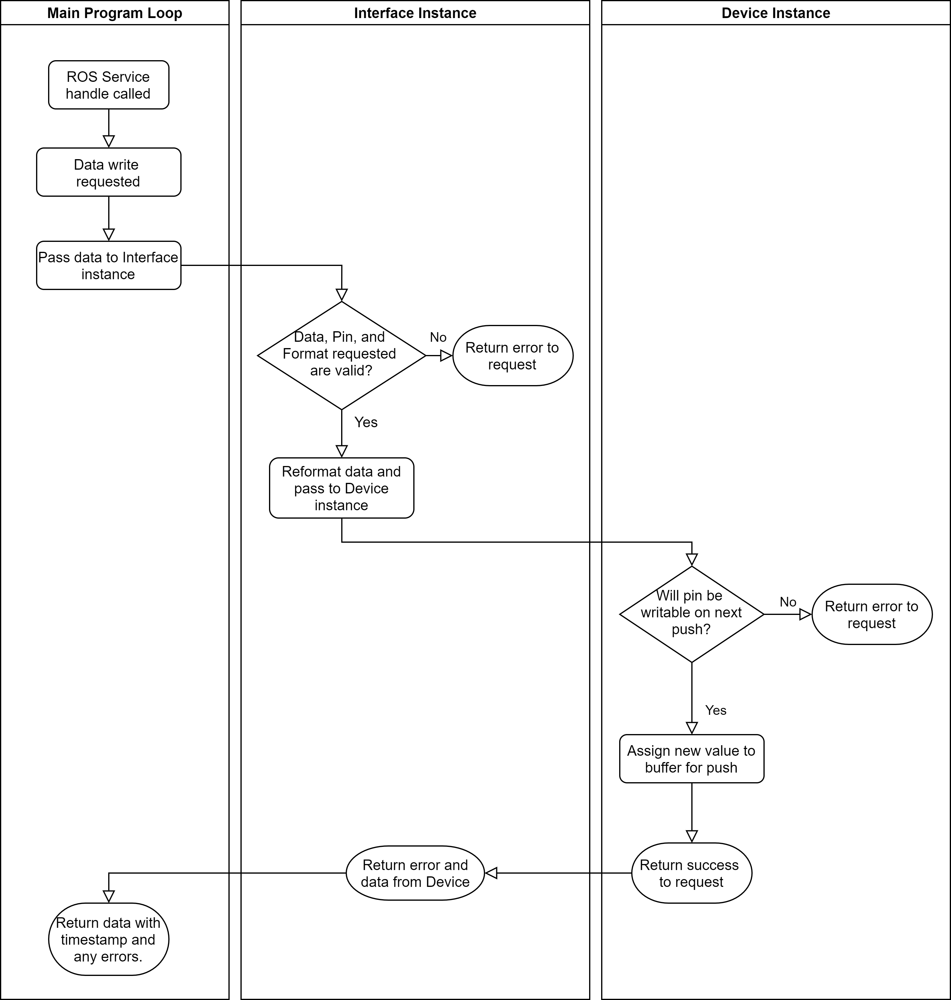
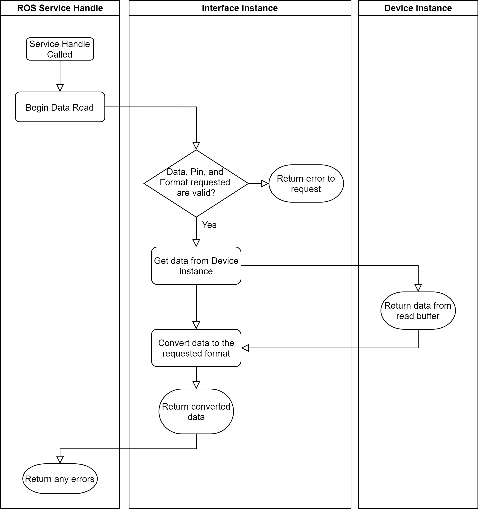
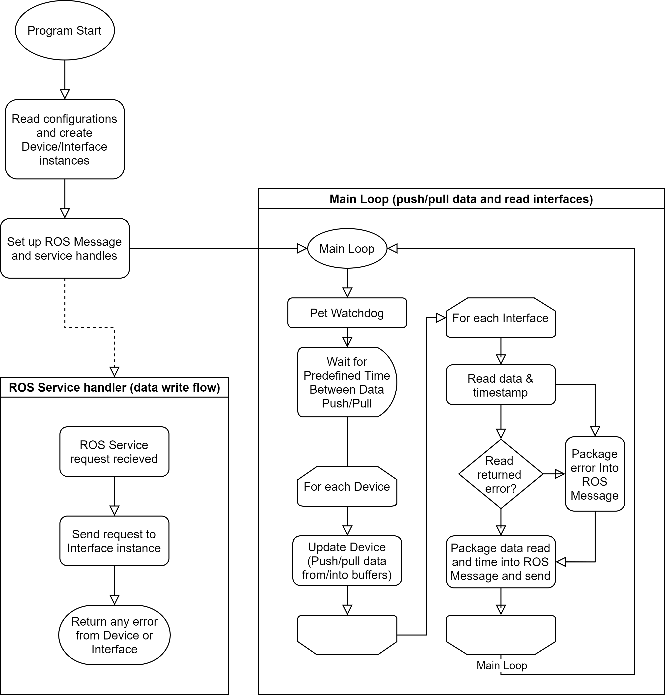

<!--
@Author: Nick Steele <nichlock>
@Date:   13:57 Aug 30 2020
@Last modified by:   nichlock
@Last modified time: 19:15 Sep 19 2020
-->

# Board Interface Package

This is the main package for our hardware I/O, and was designed to go along with the board design over at [CuUwrRobotics/interface-board](https://github.com/CuUwrRobotics/interface-board).

# How to Use it

TODO ([CuUwrRobotics/board_interface#4](https://github.com/CuUwrRobotics/board_interface/issues/4))

# How it Works

This package was designed for orthogonality and easy reconfiguration. It has two 'layers' of object types which data travels through:
- The lowest layer is hardware level, called Devices. Any individual chip or 'device' connected to the Rasperry Pi is assigned a Device instance, which can communicate with it it initialize, update data, change configurations, etc.
- The other level is the Interface, which is assigned to pins on a Device instance, and can control those pins. All external access occurs through the Interfaces.

The interface handles all data covnersions and calibrartion, while the device handles all data pushing/pulling and storage.

For an example, I will represent devices and interfaces, along iwth their pins, using YAML syntax.

Two 16 pin GPIO chips with one interface each:
```yaml
# GPIO 0
- device: "GPIO"
  - interface: "GPIO"
    - first-pin: 0
    - last-pin: 15
# GPIO 1
- device: "GPIO"
  - interface: "GPIO"
    - first-pin: 0
    - last-pin: 15
```

That was pretty simple, but also fairly useless because the interface is basically just a copy of the devices. Here is a more realistic example, showcasing the board's third GPIO chip, which contains four different types of interfaces:
```yaml
# GPIO 2
- device: "GPIO"
  - interface: "POWER" # 8 Leak sensors
    - first-pin: 0
    - last-pin: 7
  - interface: "POWER" # Power MOSFET 0
    - first-pin: 8
    - last-pin: 8
  - interface: "POWER" # Power MOSFET 1
    - first-pin: 9
    - last-pin: 9
  - interface: "POWER" # Power MOSFET 2
    - first-pin: 10
    - last-pin: 10
  - interface: "POWER" # Power MOSFET 3
    - first-pin: 11
    - last-pin: 11
  - interface: "BACKUP_GPIO" # Unused GPIO
    - first-pin: 12
    - last-pin: 12
  - interface: "BACKUP_GPIO" # Unused GPIO
    - first-pin: 13
    - last-pin: 13
  - interface: "BACKUP_GPIO" # Unused GPIO
    - first-pin: 14
    - last-pin: 14
  - interface: "LED" # LED
    - first-pin: 15
    - last-pin: 15
```

That's more complicated, but it means that we can use any interface through an associative array - making accessing specific devices and interfaces much faster and easier when an event comes through.

By using objects to handle each device and interface, the code can stay organized and capable of changing the configuration on the fly. For example, a new power interface can be added to any GPIO device's pin, allowing any special features in the `power` Interface to work without interfering with other GPIO interfaces.

This diagram shows how communication happens internally when a request to write data or configurations is recieved through ROS (or is internally triggered):



Data reads follow a similar flow:



And here's the main program loop:


